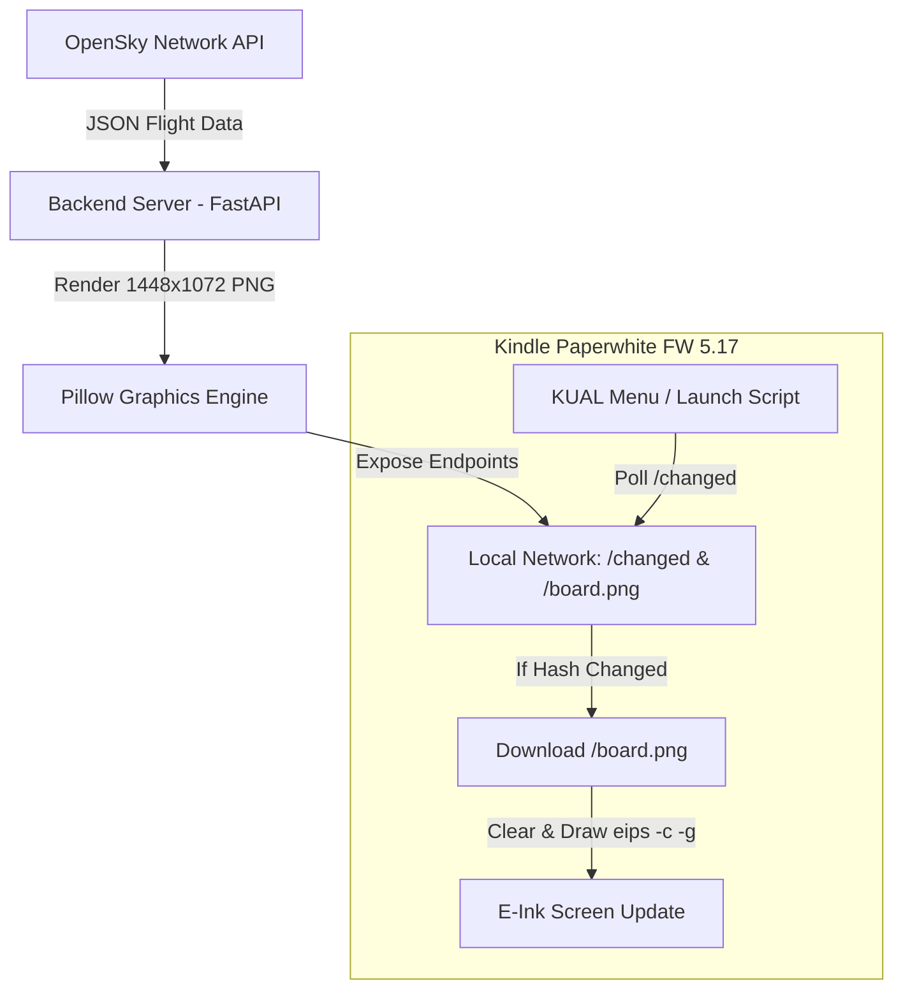

# Kindle Flight Board ✈️📺

A smart-display system that turns a jailbroken **Amazon Kindle Paperwhite** into a live flight departures/arrivals board for any airport using the **OpenSky Network API** and a local **Unraid / Docker** backend.

---

## 🌟 Key Features

- **Kindle FW 5.17 & Winterbreak Ready:** Designed specifically for Kindle Paperwhite on firmware 5.17 with KUAL integration.
- **Battery-Optimized Polling:** The Kindle checks a lightweight `/changed` hash endpoint before downloading new images, avoiding unnecessary Wi-Fi & e-ink redraw power draw.
- **1 Past & 3 Future Flights:** Automatically sorts time data to display 1 recent departure/arrival alongside 3 upcoming scheduled flights.
- **High-Contrast E-Ink Rendering:** Uses Python Pillow (PIL) to generate 1448x1072 landscape PNG images with crisp typography, airline logos, aircraft types, and status badges.
- **Robust Error & Fallback Handling:** If OpenSky Network API rate-limits or experiences downtime, the system serves fallback mockups without crashing the Kindle display.
- **Unraid & Docker Ready:** Includes `Dockerfile`, `docker-compose.yml`, and an Unraid XML container template for easy homelab deployment.

---

## 📐 Architecture Overview



---

## 📂 Monorepo Structure

```
kindle-flight-board/
├── assets/
│   ├── fonts/               # Custom fonts (Roboto, DejaVu, Inter)
│   └── logos/               # Airline logo PNGs by ICAO (AAL.png, DLH.png, etc.)
│       └── README.md
├── backend/
│   ├── app/
│   │   ├── __init__.py
│   │   ├── config.py        # Settings via Pydantic & environment variables
│   │   ├── main.py          # FastAPI application & endpoints
│   │   ├── models.py        # Pydantic data schemas
│   │   ├── opensky.py       # OpenSky API client with caching & flight sorting
│   │   └── renderer.py      # Pillow high-contrast 1448x1072 e-ink renderer
│   ├── Dockerfile           # Optimized Python 3.11-slim container build
│   └── requirements.txt
├── kindle/
│   └── extensions/
│       └── flightboard/
│           ├── config.xml   # KUAL extension configuration
│           ├── menu.json    # KUAL button definitions
│           └── bin/
│               ├── launch.sh        # Daemon background runner
│               └── update_board.sh  # Main Kindle polling daemon script
├── docker-compose.yml       # Docker Compose setup
├── unraid-template.xml      # Unraid OS Docker XML template
└── README.md
```

---

## 🚀 Backend Deployment (Unraid / Docker)

### Option 1: Docker Compose

1. Clone repository to your server:
   ```bash
   git clone https://github.com/secof/kindle-flight-board.git
   cd kindle-flight-board
   ```
2. Edit `docker-compose.yml` to set your target `AIRPORT_ICAO` (e.g. `KJFK`, `EGLL`, `KLAX`), timezone, and dimensions:
   ```yaml
   environment:
     - AIRPORT_ICAO=KJFK
     - AIRPORT_NAME=John F. Kennedy Intl
     - TIMEZONE=America/New_York
     - BOARD_WIDTH=1448
     - BOARD_HEIGHT=1072
   ```
3. Start container:
   ```bash
   docker-compose up -d --build
   ```

### Option 2: Unraid OS Container
1. Copy `unraid-template.xml` into your Unraid server template folder:
   `/boot/config/plugins/dockerMan/templates-user/my-kindle-flight-board.xml`
2. Go to **Docker** $\rightarrow$ **Add Container** in Unraid web UI and select `kindle-flight-board`.
3. Set your target airport ICAO code and click **Apply**.

---

## 📟 Kindle Setup (Firmware 5.17 / Winterbreak)

### Requirements:
- Kindle Paperwhite running Firmware **5.17** with **Winterbreak** jailbreak installed.
- **KUAL** (Kindle Unified Application Launcher) installed.

### Installation Steps:
1. Connect your Kindle to your computer via USB.
2. Copy ONLY the `flightboard` folder from `kindle/extensions/flightboard/` on your computer into the `extensions/` directory on your Kindle USB drive.
   
   > [!IMPORTANT]
   > The path on your Kindle USB drive **MUST** be exactly:
   > `[Kindle USB Root]/extensions/flightboard/menu.json`
   > (Do NOT copy as `extensions/kindle/extensions/flightboard` or `extensions/extensions/flightboard`).

3. Set your server IP by creating or editing `config.env` inside `[Kindle USB Drive]/extensions/flightboard/config.env` (or `/mnt/us/flightboard.conf`):
   ```sh
   SERVER_URL="http://192.168.1.100:8000"
   POLL_INTERVAL=60
   TOGGLE_WIFI=0
   ```
4. Safely eject your Kindle USB drive.
5. Exit KUAL if it was open, then re-open **KUAL** on your Kindle. You will now see **Kindle Flight Board** listed in the menu!

---

## ⚙️ Configuration Reference

| Environment Variable | Default | Description |
| :--- | :--- | :--- |
| `AIRPORT_ICAO` | `KJFK` | Target airport ICAO code (e.g., `KLAX`, `EGLL`, `EDDF`) |
| `AIRPORT_NAME` | `John F. Kennedy Intl` | Display title on board header |
| `TIMEZONE` | `America/New_York` | Target timezone for departure/arrival timestamps |
| `BOARD_WIDTH` | `1448` | Native Kindle display width in landscape pixels |
| `BOARD_HEIGHT` | `1072` | Native Kindle display height in landscape pixels |
| `ROTATE_DEGREES` | `0` | Image rotation (0, 90, 180, 270) |
| `INVERT_COLORS` | `false` | Invert colors for dark mode e-ink display |
| `OPENSKY_USERNAME` | `""` | Optional OpenSky Network API username |
| `OPENSKY_PASSWORD` | `""` | Optional OpenSky Network API password |

---

## 🧪 API Endpoints

- `GET /changed?hash=<HASH>`: Returns `{ "changed": true|false, "data_hash": "..." }`
- `GET /board.png`: Returns high-contrast 1448x1072 PNG image
- `GET /api/flights`: Returns raw JSON flight data
- `GET /status`: Returns last OpenSky API call, HTTP response/payload, and app settings
- `GET /health`: Container health check

---

## 📄 License
MIT License. Open source and free to customize for homelab e-ink smart displays!
